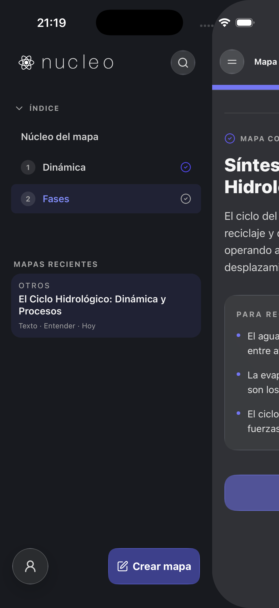
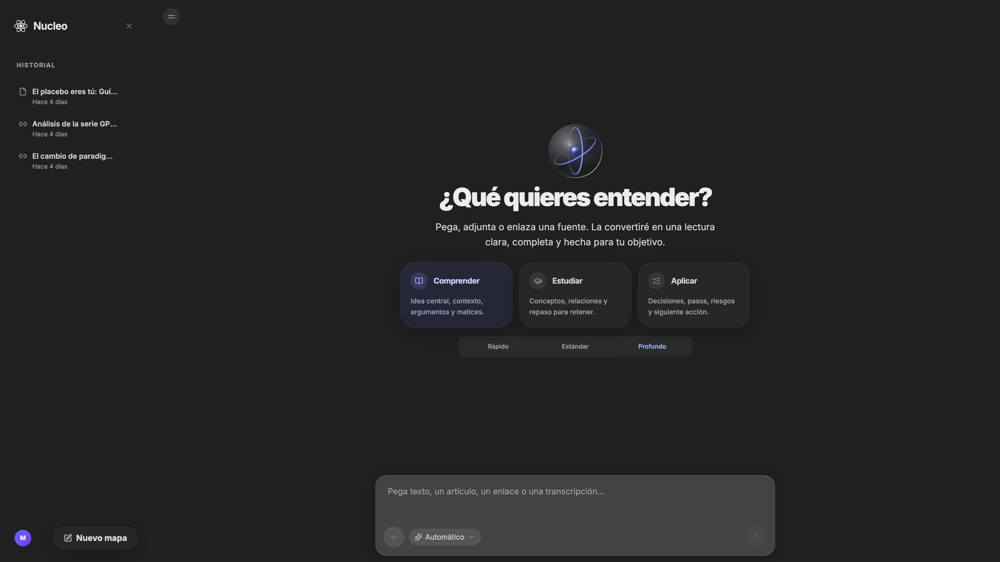

# Auditoría UI/UX — Nucleo

**Fecha:** 30 jun – 1 jul 2026
**Alcance:** App móvil (React Native / Expo, *fuente de verdad*) + Web (React/Vite) servida en `localhost:3000`, backend Express en `localhost:3000` (API).
**Método:** Simulador iOS 26.5 (iPhone 17) automatizado con `idb-companion` (script propio en `scripts/ui-audit/idb_helper.py`), inspección visual pixel a pixel, lectura estática de código (`Grep`/`Read`), navegador Chromium embebido para la web.
**Variante auditada:** Únicamente **Comprensión** (la variante *Clásica* se va a retirar del producto según indicación del usuario; sus hallazgos no se incluyen como acciones a corregir, solo se documentan de forma incidental donde ya se habían capturado).

> Capturas completas en [`docs/ui-audit/screens/`](./screens/).  
> Auditoría estética y de diseño (solo móvil Comprensión): [`aesthetics.md`](./aesthetics.md).

---

## 0. Resumen ejecutivo

| Severidad | Nº hallazgos | Estado |
|---|---|---|
| 🔴 Crítica | 1 | **Corregida** durante esta auditoría |
| 🟠 Alta | 4 | Pendiente de decisión/fix |
| 🟡 Media | 5 | Pendiente |
| 🟢 Baja | 2 | 1 corregida (quickfix), 1 documentada |

La app estaba **completamente rota en el Simulador** (pantalla "App entry not found") antes de esta auditoría. Se identificó y corrigió la causa raíz (ver §1). A partir de ahí se pudo generar un mapa real de extremo a extremo y capturar la matriz de pantallas usada en el resto del informe.

---

## 1. 🔴 CRÍTICO — La app no arrancaba en el dev client (CORREGIDO)

**Síntoma:** `[runtime not ready]: Error: Cannot find native module 'ExpoSharing'` → tras el error, Metro no lograba registrar el punto de entrada (`App entry not found. The app entry point named "main" was not registered`). La app era 100% inutilizable en el Simulador.

**Causa raíz:** el commit `c3f59a2` (28 jun, *"fix(mobile): prepare and export PDFs via native sharing"*) añadió `expo-sharing` como import de nivel superior en `AppSessionContext.tsx` y lo registró en `app.json` (`plugins`). `expo-sharing` requiere código nativo (pod `ExpoSharing`), y aunque `pod install` sí se había ejecutado (está en `Podfile.lock`), el binario `.app` instalado en el Simulador **nunca se recompiló** después de ese cambio. Cualquier `expo start` posterior solo actualiza el bundle JS, no el binario nativo — por eso Metro por sí solo nunca pudo arreglarlo.

**Fix aplicado:** `npx expo run:ios --no-bundler --device <UDID>` para recompilar el dev client con el pod `ExpoSharing` ya enlazado. Verificado extremo a extremo: la app arranca, genera un mapa, y el flujo "Guardar ficha PDF" invoca la ficha (aunque la interacción completa con la hoja de compartir nativa no se pudo verificar 100% vía automatización, ver §6 UX).

**Acción recomendada:** cualquier vez que se añada/actualice un módulo nativo (`expo-sharing`, `expo-camera`, etc.) hay que recordar re-ejecutar `npx expo run:ios` (o generar un nuevo build de desarrollo), no solo reiniciar Metro. Vale la pena documentarlo en el README de `mobile/` o añadir un check en el script de arranque que compare `Podfile.lock` contra la fecha del build instalado.

---

## 2. 🟠 ALTO — Paridad Web vs. Móvil: la web expone funcionalidad que no existe en móvil

Con la app móvil como fuente de verdad, la web (`localhost:3000`) tiene **más superficie de producto** que el móvil, no menos:

| Control | Móvil (Comprensión) | Web |
|---|---|---|
| Selector de intención | 2 opciones: **Entender / Aplicar** | 3 opciones: **Comprender / Estudiar / Aplicar** |
| Selector de profundidad | *No existe en la UI* (el backend recibe `depthPreference` pero no hay control visible) | 3 niveles visibles: **Rápido / Estándar / Profundo** |
| Copy del hero | "Separa la señal del ruido." | "¿Qué quieres entender?" |
| Sidebar de historial | Drawer superpuesto (overlay) | Panel fijo siempre visible en escritorio |

Capturas: [`screens/mobile/comprension/input-empty__light.png`](./screens/mobile/comprension/input-empty__light.png) vs [`screens/web/input-empty__dark.png`](./screens/web/input-empty__dark.png).

**Por qué importa:** si el móvil es la fuente de verdad, esto no es solo una "diferencia visual" — son *decisiones de producto* no propagadas. O bien la web tiene deuda de una versión anterior (3 intents, selector de profundidad) que el móvil ya simplificó a propósito, o el móvil está incompleto y le falta exponer el selector de profundidad. Recomiendo una decisión explícita del producto antes de tocar código, porque implica trabajo de UI + lógica de backend en cualquiera de las dos direcciones.

---

## 3. 🟠 ALTO — Re-renders globales: `AppSessionContext` mezcla estado de tecleo con todo lo demás

`mobile/src/context/AppSessionContext.tsx` expone un único contexto de **~65 campos** (líneas 1104-1231) que incluye a la vez:
- Estado que cambia en *cada pulsación de tecla* (`inputText`, `setInputText`).
- Estado de sesión que cambia raramente (`cloudSignedIn`, `historyStore`, `modelPreference`…).
- Decenas de *handlers* estables (`handleTransform`, `handleDeleteHistory`, …).

Como todo vive en el mismo `useMemo` con un único array de dependencias, **cada carácter tecleado en el composer re-renderiza a todos los consumidores de `useAppSession()`** en el árbol — incluyendo el drawer de historial, el `ProfileMenu`, banners de error, etc., estén o no montados/visibles.

```1104:1116:mobile/src/context/AppSessionContext.tsx
  const value = useMemo(
    () => ({
      phase,
      setPhase,
      inputText,
      setInputText,
      intent,
      setIntent,
      error,
      setError,
      data,
      historyStore,
      currentStep,
```

**Recomendación (cambio grande, requiere aprobación):** dividir en 2-3 contextos por frecuencia de cambio (p. ej. `ComposerContext` para `inputText`/`uploadedFile`, `SessionContext` para historial/auth/handlers), o memoizar los componentes consumidores pesados con `React.memo` + selectores. No lo he tocado porque es un cambio estructural no trivial.

---

## 4. 🟠 ALTO — Cobertura de accesibilidad incompleta en móvil

Métricas extraídas directamente del código (`mobile/src`):

| Métrica | Valor |
|---|---|
| Usos de `Pressable` | 156 |
| Usos de `accessibilityLabel` | 53 |
| Usos de `accessibilityRole` | 27 |
| Usos de `hitSlop` | solo 3 archivos |

Aproximadamente **2 de cada 3 elementos pulsables no declaran `accessibilityLabel`/`accessibilityRole`**. Con VoiceOver activado, muchos botones de icono (favoritos, categorías, menús de tres puntos) se anunciarán como "botón" sin más contexto, o directamente se saltarán. El bajísimo uso de `hitSlop` (3 archivos de ~70) sugiere que muchos iconos pequeños (24×24, 20×20) no cumplen el mínimo de 44×44pt de Apple HIG / WCAG 2.5.5.

**Contraste con la web:** la web tiene 74 usos de `aria-*` y 26 de `role="..."` en solo 13 archivos — proporcionalmente mejor cubierta que el móvil, lo cual es inusual dado que el móvil es la fuente de verdad y normalmente concentra más esfuerzo de diseño.

**Recomendación:** pase de accesibilidad dedicado sobre los componentes de icono puro (`HistoryEntryGlassMenu`, `AttachMenuPopover`, `ModelChip`, `SidebarGlassHeader`) añadiendo `accessibilityLabel`/`accessibilityRole="button"`/`hitSlop={{top:8,bottom:8,left:8,right:8}}` de forma sistemática.

---

## 5. 🟡 MEDIO — Colores "casi negros" divergentes para el fondo oscuro

Se encontraron **tres valores hexadecimales distintos** usados como "fondo oscuro" en lugar de un único token:

| Valor | Dónde |
|---|---|
| `#181A1F` | `shared/uiTokens.ts` → `APP_DARK_BACKGROUND`, usado en `ExactLiquidOrbWebView.tsx` |
| `#1A1A1A` | `AppIcon.tsx` / `NucleoIcon.tsx` (como color de texto en modo oscuro) y **todo el fondo oscuro de la web** (`src/index.css`, `html.dark { --color-app-canvas: #1A1A1A }`) |
| `#1c1c1c` | `--color-app-surface` en la web (superficies elevadas) |

`#181A1F` y `#1A1A1A` son visualmente casi idénticos pero no iguales — indicio de que se fijaron a ojo en momentos distintos en vez de referenciar un token compartido. Como el móvil es la fuente de verdad, lo correcto sería que la web usara exactamente `#181A1F` (o que `uiTokens.ts` se comparta literalmente entre plataformas, que es la intención original de `shared/`).

**Quickfix sugerido (pendiente de aprobación por tocar la web):** unificar `--color-app-canvas` dark en `src/index.css` a `#181A1F` para igualar el token móvil.

---

## 6. 🟡 MEDIO — Bug visual sospechoso en el toggle de tema de la web (necesita verificación manual)

Al cambiar "Modo oscuro" → "Modo claro" en el menú de ajustes de la web, `localStorage.theme` y la clase `.dark` en `<html>` se actualizan correctamente (verificado con `Runtime.evaluate` sobre el DOM: `hasDark: false`, `--color-app-canvas: #fafafa`), pero **la captura de pantalla siguió mostrando el panel principal en fondo oscuro** con textos casi invisibles (texto oscuro sobre fondo oscuro), incluso tras forzar scroll/resize para descartar un problema de repintado.

No pude determinar con certeza si es:
- (a) un bug real de la app (por ejemplo, `will-change: transform` en el `<main>` combinado con el custom property `--color-app-canvas` impidiendo el repintado en algunos motores), o
- (b) una particularidad del navegador Chromium embebido en la herramienta de automatización usada en esta sesión.

**Recomendación:** verificar manualmente en Safari/Chrome reales alternando el toggle de tema en `localhost:3000` antes de decidir si hay que investigar el CSS (`app-shell` / `bg-app-canvas` con `transition-colors duration-300` en `src/ComprensionApp.tsx:2776`). Marcado como no confirmado a propósito para no proponer un fix a ciegas.

---

## 7. 🟡 MEDIO — Código muerto: 3 componentes de "orbe" sin usar

Existen **5 implementaciones distintas** del orbe animado decorativo en `mobile/src/components/`:

- ✅ `ExactLiquidOrbWebView.tsx` — usado en `LoadingState.tsx` (el que se ve en producción).
- ✅ `QuantumOrbView.tsx` — usado en `AtomCanvasIcon.tsx`.
- ❌ `PremiumSphere.tsx` — **no importado por ningún otro archivo**.
- ❌ `PremiumSphereFallback.tsx` — **no importado por ningún otro archivo**.
- ❌ `LiquidGlassAtomOrb.tsx` — **no importado por ningún otro archivo** (solo referenciado por tipos desde `premiumSphereShared.ts`).

**Recomendación (quickfix seguro, pendiente de tu confirmación por si acaso hay un uso dinámico que no detecté vía grep):** eliminar los 3 archivos no usados, reduce ~esas líneas de mantenimiento y confusión para el siguiente desarrollador que busque "¿cuál orbe es el bueno?".

---

## 8. 🟡 MEDIO — Sin virtualización de listas; monolitos en la web

- **Móvil:** 0 usos de `FlatList` en todo `mobile/src`. El historial, los pasos y las secciones de conocimiento se renderizan con `ScrollView` + `.map()`. Con un historial largo (decenas/cientos de mapas guardados) esto renderiza todo el DOM nativo de golpe — funciona bien con pocos elementos (como en las capturas de esta auditoría) pero degradará con uso real prolongado.
- **Web:** `src/ComprensionApp.tsx` tiene **3281 líneas** y `src/ClassicApp.tsx` **2637 líneas** en un solo archivo cada uno, mezclando estado, efectos, lógica de red y JSX. Esto dificulta el testing, aumenta el riesgo de bugs como el de §6, y hace que cualquier cambio pequeño tenga un diff enorme.

**Recomendación (cambio grande, no aplicado):** migrar historial a `FlatList`/`FlashList` en móvil; descomponer `ComprensionApp.tsx` en subcomponentes/hooks (ya existe el patrón correcto en móvil con `AppSessionContext` + pantallas separadas — la web podría seguir el mismo modelo).

---

## 9. 🟢 BAJO — Etiqueta de accesibilidad inconsistente (CORREGIDO en Comprensión)

`InputScreen.tsx` y `ClassicInputScreen.tsx` usaban `'Abrir navegacion'` / `'Cerrar navegacion'` (sin tilde), mientras que `ReadingProgressBar.tsx` (usado en las pantallas de resultado) usa `'Abrir navegación'` (con tilde). Para un lector de pantalla son etiquetas distintas para la misma acción.

**Fix aplicado:** corregida la tilde en `mobile/src/screens/InputScreen.tsx`. No se tocó `ClassicInputScreen.tsx` porque la variante Clásica se va a retirar.

```67:67:mobile/src/screens/InputScreen.tsx
              accessibilityLabel={session.historyOpen ? 'Cerrar navegación' : 'Abrir navegación'}
```

---

## 10. 🟢 BAJO — Warning de `InteractionManager` deprecado

Aparece repetidamente en los logs de Metro:

```
WARN InteractionManager has been deprecated and will be removed in a future release.
```

Usado en `useMapHeaderAutoHide.ts` (añadido en el fix de esta misma sesión) y probablemente en otros puntos. No urgente, pero al ser una API marcada para eliminación en una futura versión de RN, conviene planear la migración a `requestIdleCallback`/`InteractionManager` alternativo cuando se actualice React Native.

---

## 11. ✅ Verificado positivamente

- **El fix de header/barra de progreso de esta sesión funciona correctamente en dispositivo real (Simulador):** en modo "Vista completa" el header se oculta al hacer scroll pero la barra de progreso permanece visible, tal y como pediste. Confirmado visualmente en [`result-viewall-scrolled__dark.png`](./screens/mobile/comprension/result-viewall-scrolled__dark.png) / `__light.png`.
- **Cadena de fallback de modelos del backend:** ante 429/503 de Gemini, el backend reintenta automáticamente con el siguiente modelo de la cadena (`gemini-3.5-flash` → `gemini-3-flash-preview` → `gemini-3-pro-preview`…), lo que en la práctica hace la generación resiliente a rate-limits puntuales — buena práctica de UX/resiliencia ya existente.
- **Cobertura de `dark:`** razonable en móvil: 285 usos de la variante `dark:` de NativeWind repartidos en el código, sin puntos obviamente "olvidados" en las pantallas auditadas visualmente.

---

## 12. Capturas de pantalla

Todas las capturas están en [`screens/`](./screens/), organizadas por plataforma/variante/tema:

```
screens/
├── mobile/
│   ├── comprension/   (input, introducción, pasos 1-2, completado, vista completa — claro y oscuro)
│   ├── classic/        (capturas incidentales; variante a retirar)
│   └── shared/         (drawer de historial, menú de ajustes — claro y oscuro)
└── web/
    └── input-empty__dark.png
```

### Selección visual — Comprensión, pantalla de inicio

| Claro | Oscuro (drawer) |
|---|---|
|  |  |

### Selección visual — Vista completa (header oculto, barra visible)

| Claro | Oscuro |
|---|---|
|  |  |

### Web (referencia de paridad)



---

## 13. Resumen de acciones

### Aplicadas ya en esta sesión
- [x] Rebuild del dev client iOS para arreglar el crash de `ExpoSharing` (§1).
- [x] Corrección de tilde en accessibilityLabel de navegación en `InputScreen.tsx` (§9).

### Pendientes de tu aprobación (cambios grandes o con impacto de producto)
- [ ] Decidir paridad de intents/profundidad móvil vs. web (§2).
- [ ] Refactor de `AppSessionContext` en contextos más pequeños (§3).
- [ ] Pase de accesibilidad sistemático (`accessibilityLabel`/`hitSlop`) en componentes de icono (§4).
- [ ] Unificar el token de fondo oscuro `#181A1F` entre móvil y web (§5).
- [ ] Verificar manualmente el bug de toggle de tema en web fuera de la herramienta de automatización (§6).
- [ ] Borrar los 3 componentes de orbe sin uso: `PremiumSphere.tsx`, `PremiumSphereFallback.tsx`, `LiquidGlassAtomOrb.tsx` (§7) — confírmame y lo hago.
- [ ] Migrar historial a lista virtualizada y descomponer los monolitos web (§8).
