# Auditoría estética y de diseño — App móvil (Comprensión)

**Fecha:** 1 jul 2026  
**Alcance:** Variante **Comprensión** en React Native / Expo (fuente de verdad). Variante Clásica ignorada.  
**Método:** Capturas automatizadas en Simulador iOS 26.5 (iPhone 17) vía `scripts/ui-audit/idb_helper.py`, inspección visual pixel a pixel, análisis estático de tokens y componentes.  
**Entregable:** Solo informe — sin cambios de código aplicados.

> Capturas en [`docs/ui-audit/screens/`](./screens/). Audit funcional previo en [`README.md`](./README.md).

---

## 0. Resumen ejecutivo

La app tiene una **identidad visual clara y diferenciada**: liquid glass nativo, acento indigo, wordmark grabado Skia, orbe de carga animado y jerarquía tipográfica basada en *eyebrows* en mayúsculas. El acabado general es **premium y coherente a nivel de producto**, pero el sistema de diseño subyacente está **infraformalizado**: tokens definidos pero poco usados, ~35 hex hardcodeados, escala de radios dispersa y paddings horizontales inconsistentes entre pantallas.

### Puntuación por área (1–5)

| Área | Nota | Comentario breve |
|------|------|------------------|
| Identidad / marca | **4.5** | Wordmark grabado + orbe + glass = personalidad fuerte |
| Coherencia de tokens | **2.5** | `uiTokens.ts` existe pero la mitad de tokens no se usa; mucho hex duplicado |
| Tipografía | **3.5** | Patrón de labels consistente; falta escala nombrada y hay tamaños ad hoc |
| Color / contraste | **3.0** | Jerarquía neutral/indigo clara; iconos blancos en menú claro y 3 fondos light distintos |
| Radios / forma | **3.0** | Familia glass reconocible; 8+ valores de radio sin tabla única |
| Espaciado / ritmo | **3.0** | `px-3` / `px-4` / `px-5` en pantallas adyacentes; secciones bien separadas en result |
| Glass / elevación | **4.0** | Stack liquid glass sólido; sombras no tokenizadas |
| Microdetalles | **3.5** | Chips, divisores y CTAs funcionan; hay oportunidades de pulido |

### Top 5 hallazgos

1. **Iconos blancos en menú de perfil (modo claro)** — `ProfileMenu` usa `#ffffff` para todos los iconos del popover; en light mode son casi invisibles sobre glass claro. **Alta / trivial.**
2. **Tres fondos distintos en modo claro** — canvas principal `#FAFAFA` (`neutral-50`), drawer `#f0f0f0`, main sheet `#fafafa` — salto visual al abrir navegación. **Media / trivial.**
3. **Sprawl de border-radius** — composer `26px` vs token `COMPOSER_CORNER_RADIUS` `22`; menús `20`, filas `14`, search `18`… sin escala documentada. **Media / medio.**
4. **~35 hex hardcodeados** — iconos Lucide y placeholders replican escala Tailwind ya disponible. **Media / medio.**
5. **Tipografía ad hoc** — `text-[10px]`…`text-[15px]` mezclados con `text-xs`…`text-3xl` sin escala nombrada. **Media / medio.**

---

## 1. Matriz de capturas

### 1.1 Cobertura actual (~70 % de la matriz objetivo)

| Estado | Claro | Oscuro |
|--------|-------|--------|
| Input vacío | ✅ `input-empty__light` | ✅ `input-empty__dark` |
| Input intent Aplicar | ✅ `input-intent-aplicar__light` | — |
| Menú adjuntar | ✅ `input-attach-menu__light` | ✅ `input-attach-menu__dark` |
| Chip modo/profundidad | ✅ `input-model-chip__light` | ✅ `input-model-chip__dark` |
| Loading | ✅ `loading__light` | ✅ `loading__dark` |
| Result intro (Núcleo) | ✅ `result-intro__light` | ✅ `result-intro__dark` |
| Result paso 1 | ✅ `result-step1__light` | ✅ `result-step1__dark` |
| Result paso 2 | ✅ `result-step2__light` | ✅ `result-step2__dark` |
| Result vista completa (top) | ✅ `result-viewall-top__light/dark` | ✅ |
| Result vista completa (scroll) | ✅ `result-viewall-scrolled__light/dark` | ✅ |
| Result completado (top/bottom) | ✅ `result-complete-top/bottom__light` | ✅ `result-complete-top__dark` |
| Drawer abierto | ✅ `shared/drawer-open__light/dark` | ✅ |
| Drawer + historial | ✅ `shared/drawer-with-history-and-profile__*` | ✅ |
| Menú perfil | ✅ `shared/profile-menu__light/dark` | ✅ |
| Ajustes | ✅ `shared/settings-menu__light/dark` | ✅ |

### 1.2 Huecos restantes (no bloquean el informe)

| Estado | Motivo |
|--------|--------|
| Input con texto / adjunto | Requiere interacción de teclado o picker nativo difícil de automatizar |
| Chat del mapa abierto | Modal con estado de sesión |
| Banner incompleto / error | Requiere forzar estados de error en backend |
| Category edit sheet | Long-press + menú contextual |
| Auth sheet | Flujo OAuth / formulario |

### 1.3 Galería representativa

#### Input y composer

| Claro | Oscuro |
|-------|--------|
| 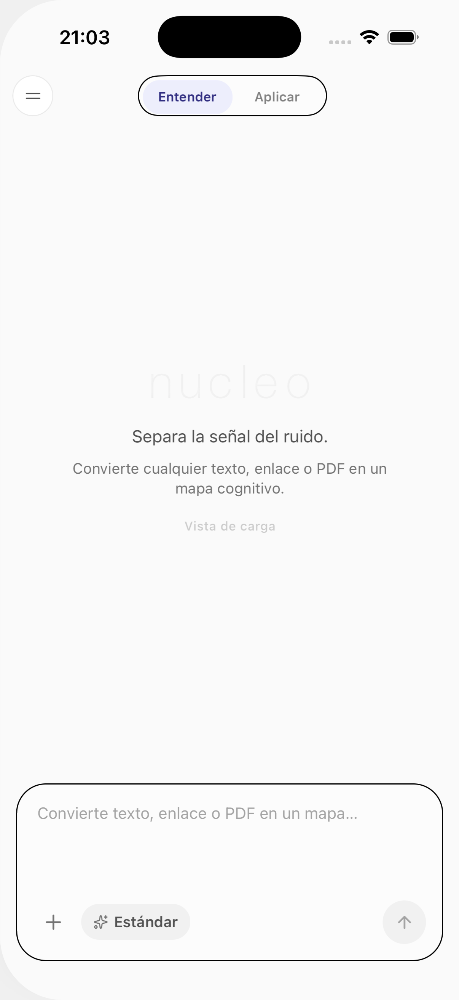 |  |
| 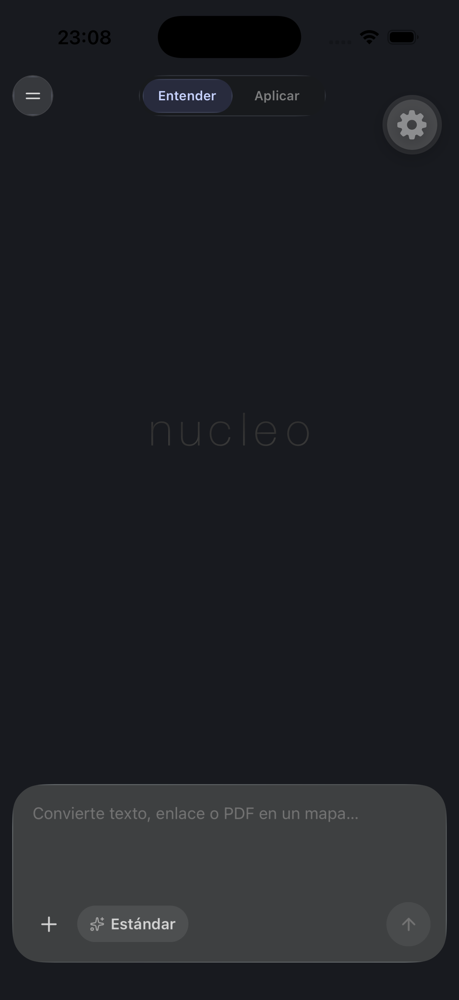 |  |
| 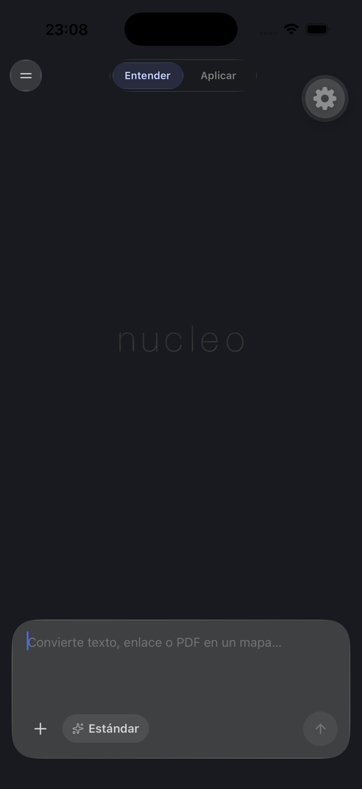 |  |

#### Loading y lectura

| Claro | Oscuro |
|-------|--------|
| 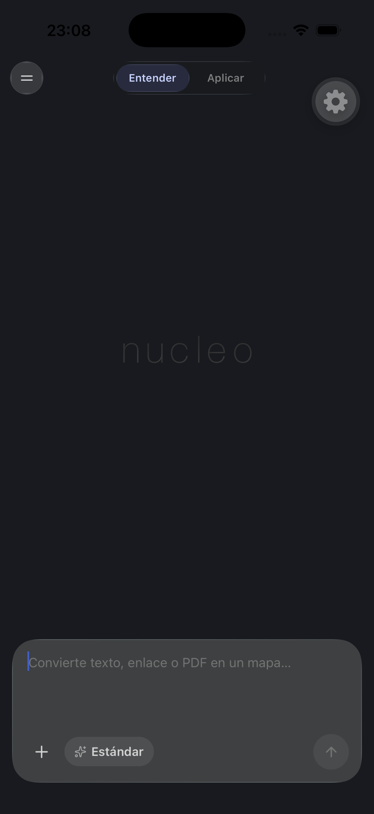 | 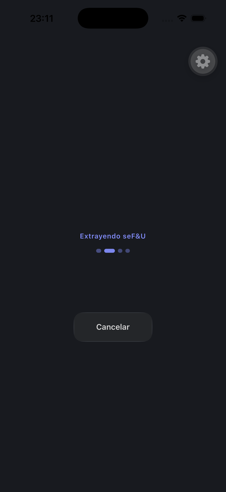 |
| 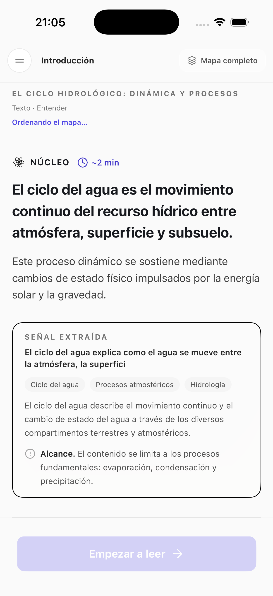 | 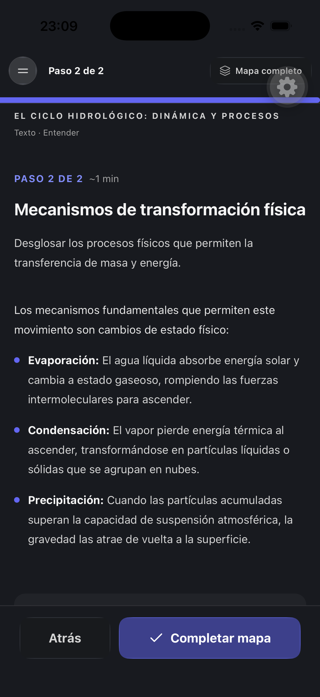 |
| 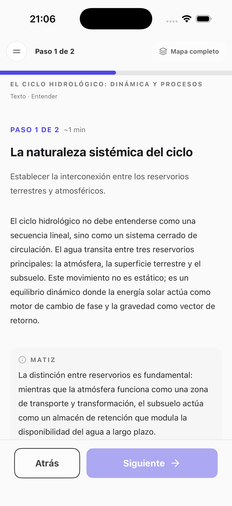 | 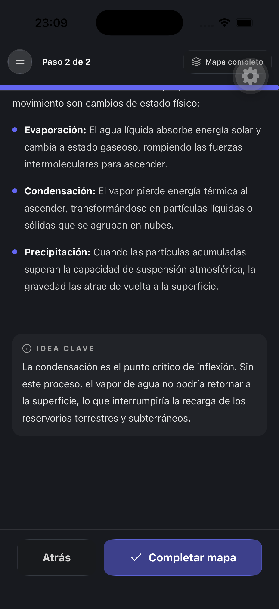 |

#### Vista completa y completado

| Claro | Oscuro |
|-------|--------|
| 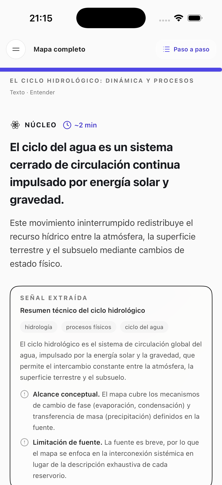 |  |
| 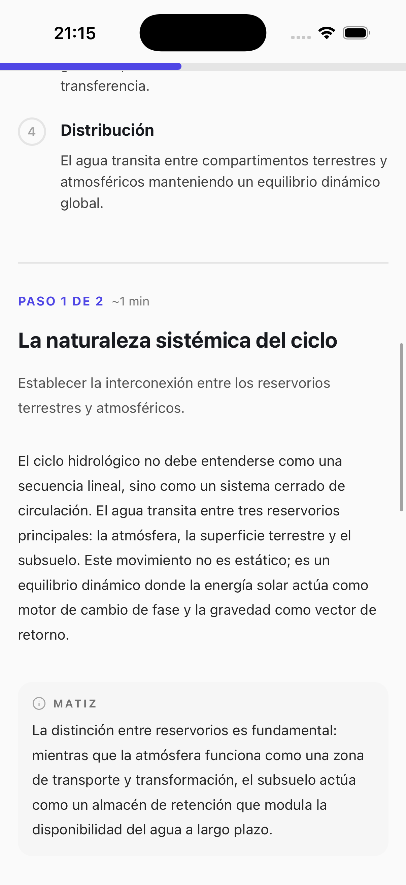 | 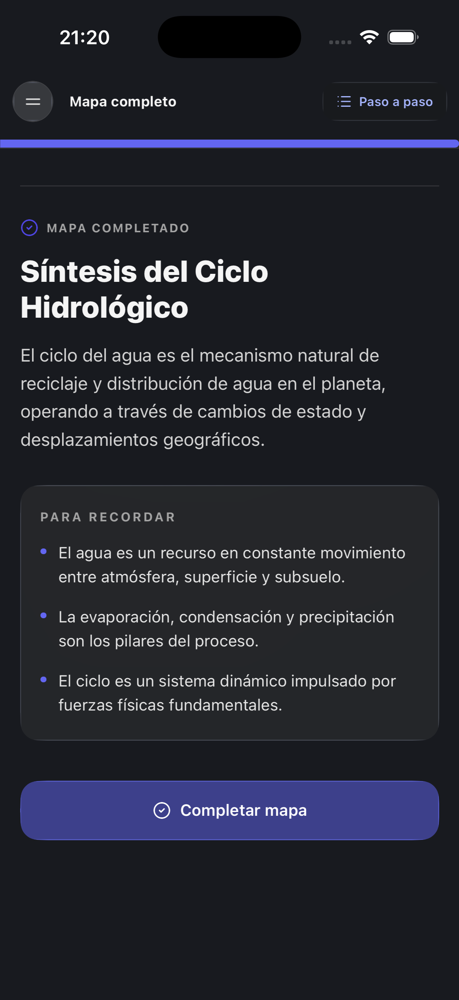 |
| 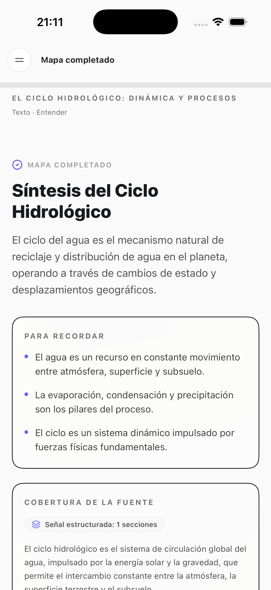 | 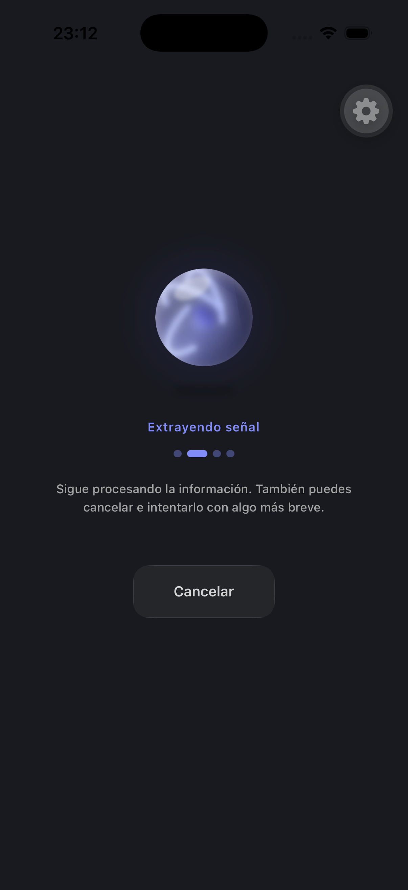 |

#### Navegación y ajustes

| Claro | Oscuro |
|-------|--------|
| 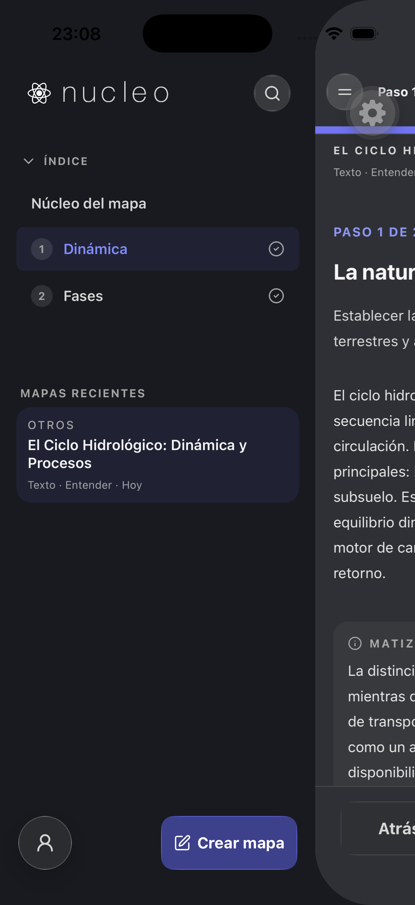 | 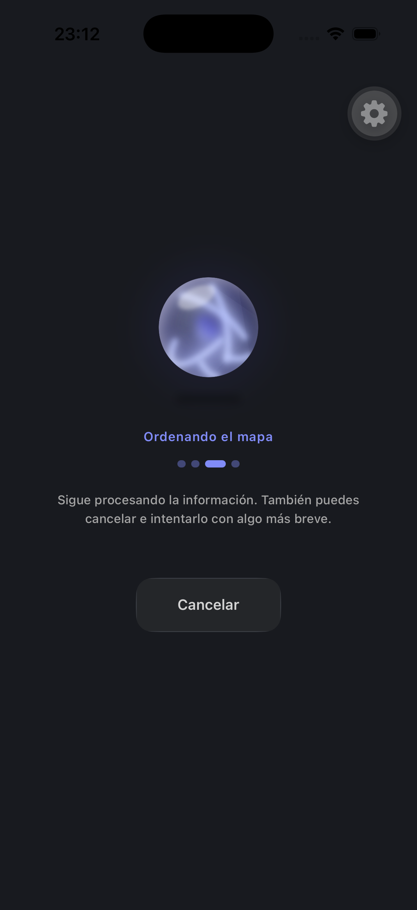 |
| 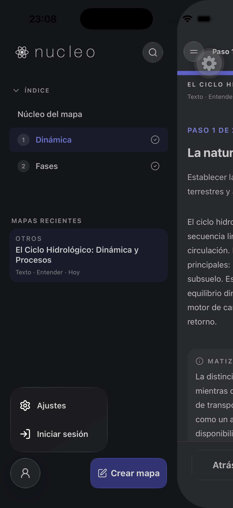 | 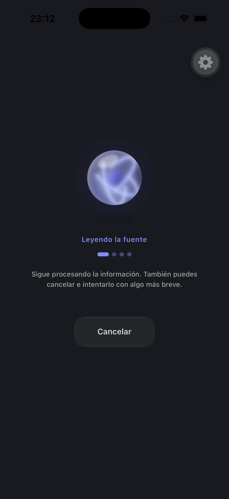 |

### 1.4 Anotaciones visuales clave (de capturas)

- **Input:** composición equilibrada — header compacto (hamburger + intent pill), hero centrado con wordmark grabado, composer anclado abajo con glass 26px. En oscuro el contraste del wordmark mejora; el copy secundario (`text-neutral-500`) pierde legibilidad relativa.
- **Loading:** orbe indigo centrado domina; fase animada y dots crean ritmo. Fondo idéntico al input — transición coherente.
- **Result intro:** `coreIdea` en `text-2xl` ancla la lectura; cards glass con overlay `bg-white/45` (light) / `bg-white/[0.05]` (dark) funcionan bien. Chip de tiempo indigo discreto.
- **View-all scrolled:** header oculto, barra de progreso 8px permanece — comportamiento visual correcto y distintivo.
- **Drawer:** main sheet con radio dinámico + sombra lateral da profundidad; **salto de tono** entre sidebar `#f0f0f0` y canvas `#fafafa` visible en light.
- **Profile menu (light):** iconos del popover apenas visibles — confirmado en captura.

---

## 2. Parte A — Coherencia del sistema de diseño

### 2.1 Tokens (`shared/uiTokens.ts`)

| ID | Hallazgo | Severidad | Esfuerzo | Archivo |
|----|----------|-----------|----------|---------|
| A-01 | Solo 6 de 12 exports se usan en móvil. Sin uso: `COMPOSER_CORNER_RADIUS` (22), `DRAWER_CORNER_RADIUS` (28), `HAIRLINE`, `INSET_HIGHLIGHT_*`, `liquidGlassFloatingShellClass`, `COMPOSER_DARK_INSET` | Media | Trivial | `shared/uiTokens.ts` |
| A-02 | Composer usa radio **26** hardcodeado; token dice **22** — divergencia documentada vs implementada | Media | Trivial | `ComposerSurface.tsx:20`, `uiTokens.ts:38` |
| A-03 | `COMPOSER_DARK_SURFACE` duplicado como `bg-[#3E4041]` en blur fallback | Baja | Trivial | `GlassSurface.tsx:156` |
| A-04 | Tailwind solo extiende `neutral.900` → `#181A1F`; resto depende de defaults | Baja | Medio | `mobile/tailwind.config.js` |

### 2.2 Color

| ID | Hallazgo | Severidad | Esfuerzo | Archivo |
|----|----------|-----------|----------|---------|
| A-05 | **~35 valores hex** hardcodeados (~95 apariciones), mayoría en props `color` de Lucide y `placeholderTextColor` | Media | Medio | Ver apéndice C |
| A-06 | **Tres fondos light:** pantalla `bg-neutral-50` (#FAFAFA), drawer sidebar `#f0f0f0`, main sheet `#fafafa` — no unificados | Media | Trivial | `HistoryDrawer.tsx:86,227`, pantallas |
| A-07 | `AppIcon` light usa `#1A1A1A`; token canvas oscuro es `#181A1F` — negros ligeramente distintos | Baja | Trivial | `AppIcon.tsx:13` |
| A-08 | **`ProfileMenu` iconos siempre `#ffffff`** en popover glass; en light mode iconos casi invisibles (texto sí usa neutral-700) | **Alta** | Trivial | `ProfileMenu.tsx:79` |
| A-09 | Patrón repetido `navIconColor = isDark ? '#d4d4d4' : '#525252'` copiado en 4+ archivos | Media | Medio | `InputScreen`, `ReadingProgressBar`, `SidebarGlassHeader`, `AttachMenu` |
| A-10 | Acento indigo: mezcla `#4f46e5`, `#6366f1`, `#4338ca`, `#3730a3`, `#312e81`, `#c7d2fe`, `#e8eaff` sin rol semántico único | Media | Medio | Múltiples componentes |

### 2.3 Tipografía

| ID | Hallazgo | Severidad | Esfuerzo | Archivo |
|----|----------|-----------|----------|---------|
| A-11 | Fuente **system** (SF Pro / Roboto); sin `expo-font` ni familia de marca | Baja | Grande | App-wide |
| A-12 | **Sin escala tipográfica nombrada** — 6 tamaños arbitrarios (`10–15px`) + clases Tailwind | Media | Medio | Ver apéndice B |
| A-13 | Patrón **eyebrow** muy consistente: `text-[11px] font-bold uppercase tracking-widest` — buen ancla | ✅ Fortaleza | — | Cards, sections |
| A-14 | Hero copy usa `15px`/`13px`; CTAs footer usan `text-lg`; salto grande entre zonas | Baja | Medio | `InputScreen.tsx:102-105` |
| A-15 | `EngravedNucleoMark` usa Skia + Helvetica Neue 200 — único elemento con fontFamily explícita | Info | — | `EngravedNucleoMark.tsx` |
| A-16 | `text-neutral-500` en hero oscuro sin variante `dark:` más clara — contraste borderline en copy secundario | Media | Trivial | `InputScreen.tsx:105` |

### 2.4 Radios y forma

| ID | Hallazgo | Severidad | Esfuerzo | Archivo |
|----|----------|-----------|----------|---------|
| A-17 | **8+ radios activos:** 12, 14, 16, 18, 20, 22, 24, 26 + dinámico drawer + pills | Media | Medio | Ver apéndice D |
| A-18 | `RADII` (sm/md/lg/xl) usado en cards glass pero no en composer, menús ni sheets | Media | Medio | `uiTokens.ts`, componentes glass |
| A-19 | Menús glass unificados en **20px** — buena convención implícita | ✅ Fortaleza | — | `AttachMenuPopover`, `ProfileMenu`, `HistoryEntryGlassMenu` |
| A-20 | Filas interactivas en menús: **14px** — consistente dentro del cluster de menús | ✅ Fortaleza | — | `ProfileMenu`, `AttachMenuPopover` |

### 2.5 Espaciado y ritmo

| ID | Hallazgo | Severidad | Esfuerzo | Archivo |
|----|----------|-----------|----------|---------|
| A-21 | Padding horizontal **inconsistente:** header input `px-3`, toolbar composer `px-4`, contenido result `px-5` | Media | Trivial | `InputScreen`, `ResultScreen` |
| A-22 | Separación vertical de secciones en result (`mb-8`, `mt-8 pt-8 border-t`) — **ritmo fuerte y legible** | ✅ Fortaleza | — | `ResultScreen.tsx` |
| A-23 | Composer dock gap fijo 12px (`COMPOSER_DOCK_GAP`) — bien parametrizado | ✅ Fortaleza | — | `ComposerDock.tsx` |
| A-24 | Footer step nav altura 52px alineada con floating buttons — coherencia táctil | ✅ Fortaleza | — | `StepFooterGlassButton`, `FloatingGlassButton` |

### 2.6 Sombras y elevación

| ID | Hallazgo | Severidad | Esfuerzo | Archivo |
|----|----------|-----------|----------|---------|
| A-25 | **Sin tokens de sombra** — 3 implementaciones independientes | Media | Medio | Ver abajo |
| A-26 | `FloatingGlassButton`: shadowOpacity 0.08–0.18, radius 10–20, accent `#4f46e5` | Info | Medio | `FloatingGlassButton.tsx:204-231` |
| A-27 | `HistoryDrawer` main sheet: offset (-10,0), radius 24, opacity 0.22/0.55 | Info | Medio | `HistoryDrawer.tsx:197-201` |
| A-28 | `SessionErrorBanner`: offset (0,2), opacity 0.08, radius 8 | Info | Medio | `SessionErrorBanner.tsx:73` |
| A-29 | Menús usan `shadow-xl` Tailwind además de glass — elevación adecuada visualmente | ✅ Fortaleza | — | `ProfileMenu`, `HistoryEntryGlassMenu` |

### 2.7 Glass / liquid surfaces

| ID | Hallazgo | Severidad | Esfuerzo | Archivo |
|----|----------|-----------|----------|---------|
| A-30 | Stack glass maduro: `GlassSurface` → `LiquidGlassSurface` / blur fallback + `LiquidGlassMotionShell` en composer | ✅ Fortaleza | — | `GlassSurface.tsx` |
| A-31 | Bordes perimeter solo en **light mode** (`liquidGlassShellClasses`) — asimetría intencional pero cambia peso visual entre temas | Baja | Medio | `uiTokens.ts:5-21` |
| A-32 | Cards glass comparten overlay: dark `bg-white/[0.05]`, light `bg-white/45` — **patrón repetible** | ✅ Fortaleza | — | `TakeawaysGlassCard`, `SourceCoverageCard`, etc. |
| A-33 | Composer motion (scale 1.018, sheen sweep, indigo ring) — micro-interacción premium | ✅ Fortaleza | — | `LiquidGlassMotionShell.tsx` |
| A-34 | Orbe loading (`ExactLiquidOrbWebView`) usa gradientes propios `#c7d2fe→#6366f1→#1e1a4b` — alineado con indigo pero no tokenizado | Baja | Medio | `ExactLiquidOrbWebView.tsx` |

### 2.8 Contraste y legibilidad (estimación WCAG)

| Par | Ratio estimado | AA normal | AA grande | Notas |
|-----|----------------|-----------|-----------|-------|
| `text-neutral-900` on `#FAFAFA` | ~18:1 | ✅ | ✅ | Headlines |
| `text-neutral-600` on `#FAFAFA` | ~5.5:1 | ✅ | ✅ | Hero primary copy |
| `text-neutral-500` on `#FAFAFA` | ~4.6:1 | ⚠️ borderline | ✅ | Hero secondary, chips |
| `text-[11px] neutral-500` uppercase | ~4.6:1 @ 11px | ❌ likely fail | ⚠️ | Eyebrows — tamaño pequeño |
| `text-neutral-400` on `#181A1F` | ~5.8:1 | ✅ | ✅ | Labels dark |
| `#ffffff` icons on light glass | ~1.2:1 | ❌ | ❌ | ProfileMenu popover light |

---

## 3. Parte B — Propuestas de elevación visual

Priorizadas por impacto visual × esfuerzo. **No implementadas** — requieren aprobación en fase posterior.

### B1. Quick wins (impacto alto, esfuerzo trivial–bajo)

| # | Propuesta | Impacto | Riesgo | Esfuerzo | Referencia |
|---|-----------|---------|--------|----------|------------|
| **B1.1** | Corregir color de iconos en `ProfileMenu` popover: usar `isDark ? '#d4d4d4' : '#525252'` (igual que nav) en lugar de `#ffffff` fijo | Alto | Bajo | Trivial | `ProfileMenu.tsx:79` |
| **B1.2** | Unificar fondo light a un solo token (`APP_LIGHT_CANVAS = '#FAFAFA'`) para pantalla, drawer y main sheet | Medio | Bajo | Trivial | `HistoryDrawer.tsx`, pantallas |
| **B1.3** | Añadir `dark:text-neutral-400` al copy secundario del hero que hoy usa `dark:text-neutral-500` idéntico al light | Medio | Bajo | Trivial | `InputScreen.tsx:105` |
| **B1.4** | Sincronizar `COMPOSER_CORNER_RADIUS` token a **26** (o bajar composer a 22) — una sola fuente | Medio | Bajo | Trivial | `uiTokens.ts`, `ComposerSurface.tsx` |
| **B1.5** | Reemplazar `bg-[#3E4041]` por `COMPOSER_DARK_SURFACE` en className o StyleSheet | Bajo | Bajo | Trivial | `GlassSurface.tsx:156` |

### B2. Sistema de diseño (impacto alto, esfuerzo medio)

| # | Propuesta | Impacto | Riesgo | Esfuerzo | Detalle |
|---|-----------|---------|--------|----------|---------|
| **B2.1** | **Escala tipográfica nombrada** en `uiTokens.ts` o Tailwind extend | Alto | Medio | Medio | `label-xs: 10`, `label-sm: 11`, `body-sm: 13`, `body: 15/16`, `headline: 24`, `display: 30` |
| **B2.2** | **Helper `iconColor(role)`** centralizado: `muted`, `nav`, `accent`, `destructive`, `onAccent` | Alto | Bajo | Medio | Elimina ~95 hex duplicados |
| **B2.3** | **Tabla de radios** formal: `RADII.sm=12` (bars), `.md=16` (cards), `.lg=20` (menus), `.xl=26` (composer), `.row=14` (menu items) | Medio | Medio | Medio | Migrar hardcoded gradualmente |
| **B2.4** | **Tokens de elevación** `ELEVATION.floating`, `.sheet`, `.banner` con shadowColor/Offset/Opacity/Radius | Medio | Bajo | Medio | Unificar 3 implementaciones actuales |
| **B2.5** | **Paleta indigo semántica**: `accent`, `accent-muted`, `accent-subtle`, `accent-on-dark` — 4 tokens en lugar de 7+ hex | Medio | Medio | Medio | IntentSelector, progress, CTAs |
| **B2.6** | Padding horizontal unificado **`px-4`** en input header, composer y result (o `px-5` everywhere) | Medio | Bajo | Medio | Alineación óptica entre fases |

### B3. Pulido premium (impacto medio–alto, esfuerzo medio–grande)

| # | Propuesta | Impacto | Riesgo | Esfuerzo | Detalle |
|---|-----------|---------|--------|----------|---------|
| **B3.1** | **Tipografía de marca opcional**: cargar Inter o similar para UI; mantener Skia engraved para wordmark | Alto | Medio | Grande | Evaluar peso del bundle + `expo-font` |
| **B3.2** | **Reference chips** en result: unificar borde/fondo con glass chips en lugar de pills planos con borde neutral | Medio | Bajo | Medio | `ResultScreen.tsx` `ReferencesChips` |
| **B3.3** | **Orbe loading**: extraer gradientes a tokens compartidos con `ExactLiquidOrbWebView` + reducir glow CSS en dark para evitar halo excesivo | Medio | Bajo | Medio | `ExactLiquidOrbWebView.tsx` |
| **B3.4** | **Cards glass en dark**: subir overlay de `bg-white/[0.05]` a `bg-white/[0.08]` para más definición sin perder translucidez | Medio | Bajo | Medio | Cluster de cards |
| **B3.5** | **Divisores de sección view-all**: sustituir `border-b border-neutral-200` por gradiente fade o hairline con opacidad animada al scroll-spy | Bajo | Bajo | Medio | `ResultScreen.tsx` view-all |
| **B3.6** | **Intent selector thumb**: añadir sombra sutil al thumb deslizante en light mode para separarlo del track glass | Medio | Bajo | Medio | `IntentSelector.tsx` |
| **B3.7** | **Drawer transition**: easing más suave en radio + sombra (spring con damping mayor) — sensación más iOS-native | Bajo | Bajo | Medio | `HistoryDrawer.tsx` Reanimated |
| **B3.8** | **Eliminar opción Clásica** del submenú Ajustes cuando se retire la variante — reduce ruido visual en settings | Bajo | Bajo | Trivial | `ProfileMenu.tsx` |

### B4. Mockups textuales (antes → después)

**ProfileMenu (light):**
```
ANTES:  [glass claro]  ⚪ Ajustes     ← icono blanco invisible
                    ⚪ Iniciar sesión

DESPUÉS: [glass claro]  ⚙️ Ajustes     ← #525252, legible
                    🔑 Iniciar sesión
```

**Escala tipográfica propuesta:**
```
display    30px/36  extrabold   "Mapa completado"
headline   24px/36  bold        coreIdea, step titles
body-lg    18px/28  regular     coreSupport, summaries
body       16px/24  regular     prose, inputs
body-sm    13px/20  medium      hero secondary, chip labels
label      11px/16  bold uppercase tracking-widest  section eyebrows
label-xs   10px/14  bold uppercase  nested labels
```

**Radios propuestos:**
```
composer   26px   (único elemento más redondeado — ancla visual)
menu       20px   (popovers, chat bubbles)
card       16px   (glass content cards) = RADII.md
bar        12px   (footer CTAs, header bars) = RADII.sm
row        14px   (menu items)
pill       9999   (chips, avatars)
```

---

## 4. Fortalezas a preservar

Estos elementos **no deben simplificarse** en aras de consistencia — son la identidad del producto:

1. **Wordmark grabado Skia** (`EngravedNucleoMark`) — diferenciador premium en input vacío.
2. **Liquid glass nativo** con fallback blur — aprovecha iOS 26; sensación nativa superior.
3. **Composer con motion shell** — focus pulse + sheen = interacción memorable.
4. **Patrón eyebrow** (`11px uppercase tracking-widest`) — jerarquía clara en mapas densos.
5. **Barra de progreso de lectura** — nav + progress line con auto-hide inteligente.
6. **Orbe de loading animado** — transición emocional entre input y result.
7. **Intent selector** pill glass con thumb deslizante — compacto y elegante.

---

## 5. Apéndices

### Apéndice A — Inventario de tokens (`shared/uiTokens.ts`)

| Token | Valor | Uso en móvil |
|-------|-------|--------------|
| `APP_DARK_BACKGROUND` | `#181A1F` | Drawer, sheet |
| `APP_DARK_BACKGROUND_RGB` | `24, 26, 31` | LiquidGlassSurface fallback |
| `COMPOSER_DARK_SURFACE` | `#3E4041` | Glass composer overlay |
| `RADII.sm/md/lg/xl/pill` | 12/16/20/28/9999 | Cards glass, bars |
| `BLUR_INTENSITY` | 24 | BlurView default |
| `COMPOSER_CORNER_RADIUS` | 22 | **Sin uso** (composer = 26) |
| `DRAWER_CORNER_RADIUS` | 28 | **Sin uso** (usa cálculo dinámico) |
| `HAIRLINE` | 1 | **Sin uso** |
| `INSET_HIGHLIGHT_LIGHT/DARK` | box-shadow strings | **Sin uso** |
| `COMPOSER_DARK_INSET` | box-shadow string | **Sin uso** (orientado web) |
| `liquidGlassShellClasses()` | border light only | GlassSurface, motion shell |
| `liquidGlassFloatingShellClass()` | border white/10 dark | **Sin uso** |

### Apéndice B — Escala tipográfica real (Comprensión)

| Token ad hoc | Tailwind equiv. | Rol | Archivos principales |
|--------------|-----------------|-----|---------------------|
| `text-[10px]` | — | Nested label | `KnowledgeSectionsList`, `SourceCoverageCard` |
| `text-[11px]` | ~xs | **Eyebrow** dominante | Cards, progress, history, chat |
| `text-[12px]` | xs | Loading patience copy | `LoadingState` |
| `text-[13px]` | — | Chip label, hero sub | `ModelChip`, `InputScreen`, `MapCategoryLabel` |
| `text-[15px]` | — | Hero primary, CTA text | `InputScreen`, `HistorySheet` |
| `text-xs` | 12px | Meta, badges | Reference chips, source line |
| `text-sm` | 14px | Nav labels, phase text | `ReadingProgressBar`, `LoadingState` |
| `text-base` | 16px | Body, inputs, menus | Widespread |
| `text-lg` | 18px | Support text, footer CTAs | `ResultScreen`, `StepFooterNav` |
| `text-2xl` | 24px | coreIdea, step titles | `ResultScreen` |
| `text-3xl` | 30px | Completion headline | `ResultScreen` |

### Apéndice C — Mapa de hex hardcodeados (top 20)

| Hex | Rol Tailwind equivalente | Apariciones ~ |
|-----|--------------------------|---------------|
| `#ffffff` / `#fff` | white | 20 |
| `#525252` | neutral-600 | 12 |
| `#737373` | neutral-500 | 18 |
| `#a3a3a3` | neutral-400 | 14 |
| `#d4d4d4` | neutral-300 | 6 |
| `#4f46e5` | indigo-600 | 8 |
| `#6366f1` | indigo-500 | 6 |
| `#4338ca` | indigo-700 | 2 |
| `#3730a3` | indigo-800 | 1 |
| `#312e81` | indigo-900 | 1 |
| `#c7d2fe` | indigo-200 | 2 |
| `#e8eaff` | custom lilac | 1 |
| `#181A1F` | APP_DARK_BACKGROUND | 2 |
| `#FAFAFA` / `#fafafa` | neutral-50 | 4 |
| `#f0f0f0` | — (no token) | 2 |
| `#1A1A1A` | near neutral-900 | 2 |
| `#EDEDED` | — | 2 |
| `#dc2626` | red-600 | 1 |
| `#d97706` | amber-600 | 3 |
| `#000000` | black (shadows) | 4 |

### Apéndice D — Mapa de border-radius

| px | Componente / uso |
|----|------------------|
| 12 | `RADII.sm` — footer glass bars, map header |
| 14 | Menu row hit targets (Profile, Attach, History menus) |
| 16 | `RADII.md` — glass content cards |
| 18 | Search pill (`SidebarGlassHeader`), IntentSelector outer |
| 20 | Glass menus, chat bubbles, default `GlassSurface` |
| 22 | ModelChip sheet top |
| 24 | CategoryEditSheet top, floating pill radius |
| 26 | **Composer** (`ComposerSurface`) |
| 28 | `RADII.xl` / `DRAWER_CORNER_RADIUS` (token unused; drawer uses screen-derived) |
| 52–62 | `MAIN_SHEET_CORNER_RADIUS` — animated drawer main sheet |
| 9999 | Pills, avatars, progress dots |

### Apéndice E — Componentes glass (referencia rápida)

```
GlassSurface (facade)
├── LiquidGlassSurface (iOS 26 GlassView / rgba fallback)
├── BlurView (legacy path)
├── LiquidGlassMotionShell (composer animations)
├── GlassBarShell (footer CTAs, RADII.sm)
└── GlassPerimeterRing (small circles)

Consumidores principales:
  ComposerSurface (26px) · FloatingGlassButton · IntentSelector
  AttachMenuPopover · ProfileMenu · HistoryEntryGlassMenu
  TakeawaysGlassCard · SourceCoverageCard · KnowledgeSectionsList
  SourceMetadataGlassCard · CompletionGlassButton · StepFooterGlassButton
  SidebarGlassHeader (search 18px) · AuthSheet header · ModelChip sheet
```

---

## 6. Próximos pasos sugeridos

1. **Aprobar quick wins B1.1–B1.5** — especialmente iconos ProfileMenu (bug visual confirmado en captura).
2. **Decidir** si se invierte en tipografía de marca (B3.1) o se mantiene system font.
3. **Fase de tokenización** (B2.1–B2.6) como PR dedicado, sin cambiar layout.
4. **Revisitar capturas faltantes** (input con adjunto, chat, error states) en sesión manual o con datos seed.

---

*Generado como parte de la auditoría estética. No se modificó código de producción.*
